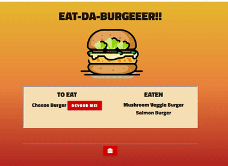

# burger

### Description

This application it's a Burger logger built with h MySQL, Node, Express, Handlebars and ORM.    I used Node and MySQL to query and route data and Handlebars to generate HTML.

*Key words* : 
*Servers*, *Express.js*, *MySQL* , *API routes*, *Handeblars*, *Object-relational mapping*, *Model-View-Controller*, *Template engines* 

### Technologies used 
Express.Js  
Postman  
Handlebar.js  
Materialize  

### Link
Check it out! 

  

Link to a complete demo video 
[https://polar-hamlet-23486.herokuapp.com/]

